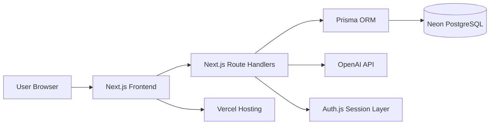

# Architecture: Job Application Tracker with AI Match Insights

## 1. Overview
This project is a polished 3-week portfolio MVP for individual job seekers. It allows users to sign in, manage job applications, save resume text, save job descriptions, generate AI-based match insights, create reminders, and view dashboard analytics.

The architecture is intentionally practical and not over-engineered. It prioritizes shipping a working, deployable product with modern full-stack patterns.

---

## 2. High-Level Architecture

### Frontend layer
- Built with Next.js + TypeScript
- Uses the App Router
- Renders pages for authentication, dashboard, applications, resume, reminders, and AI insights
- Communicates with the backend through Next.js Route Handlers

### API/backend layer
- Implemented with Next.js Route Handlers / API routes
- Handles:
  - authentication/session logic
  - CRUD for applications
  - resume text storage
  - reminders
  - AI insight generation
  - dashboard analytics
- Validates input using Zod

### Database layer
- PostgreSQL hosted on Neon
- Stores users, applications, companies, resumes, reminders, and AI insight results

### Authentication/session layer
- Auth.js manages login, session, and protected routes
- Sessions are tied to the authenticated user

### AI service layer
- OpenAI API is called only when the user clicks “Generate Match Insights”
- AI output is validated and stored so users can view previous results without regenerating

### Deployment layer
- Vercel hosts the Next.js app and API routes
- Neon provides the PostgreSQL database
- Environment variables store secrets securely

---

## 3. System Context

---

## 4. Core User Flows

### A. User sign up / sign in
1. User opens sign-in or sign-up page.
2. Frontend submits credentials to Auth.js.
3. Auth.js validates credentials and creates or loads the user session.
4. Session is stored securely.
5. User is redirected to the dashboard or application list.

### B. Creating a job application
1. User fills out a form with job title, company, status, job description, and date.
2. Frontend validates the data.
3. The app sends a POST request to the applications API route.
4. The route verifies authentication.
5. Prisma creates the application record in PostgreSQL.
6. The UI refreshes to show the new application.

### C. Updating application stage/status
1. User changes the application stage from Applied to Interview, Offer, Rejected, etc.
2. Frontend sends an update request.
3. Backend verifies the application belongs to the current authenticated user.
4. Prisma updates the application row.
5. Dashboard counters and lists refresh.

### D. Saving resume text
1. User pastes resume text into the resume form.
2. Frontend validates the input.
3. The app sends the resume text to the resume API route.
4. Prisma stores the latest resume snapshot for the user.
5. The UI confirms it was saved.

### E. Generating AI match insights
1. User selects an application and clicks “Generate Match Insights”.
2. Frontend sends the resume text and job description to the AI route.
3. The backend constructs a prompt.
4. OpenAI returns structured analysis.
5. Backend validates the output.
6. Prisma stores the AI insight result linked to the application and user.
7. Frontend displays the insights.

### F. Saving and viewing AI match results
1. After generation, the result is stored in the database.
2. Future visits load the saved result instead of calling the API again.
3. Users can review previous analysis without extra cost.

### G. Creating and completing reminders
1. User creates a reminder with title, date, and notes.
2. Frontend sends it to the reminders API route.
3. Prisma stores the reminder for the current user.
4. User can later mark it completed.
5. The reminder status updates in the database.

### H. Loading dashboard analytics
1. User opens the dashboard.
2. Frontend requests analytics data from the analytics route.
3. Backend aggregates counts by stage and recent activity.
4. Recharts renders the visual summary.

---

## 5. Backend/API Module Breakdown

### Auth routes
- POST /api/auth/signup
- POST /api/auth/signin
- POST /api/auth/signout
- GET /api/auth/session

Responsibilities:
- Register users
- Authenticate users
- Create or destroy sessions
- Protect private routes

### Application routes
- GET /api/applications
- GET /api/applications/:id
- POST /api/applications
- PATCH /api/applications/:id
- DELETE /api/applications/:id

Responsibilities:
- Create, list, update, and delete applications
- Enforce user ownership
- Support search/filtering by status, company, or title

### Resume routes
- GET /api/resume
- POST /api/resume
- PUT /api/resume

Responsibilities:
- Save or update the user’s resume text
- Return the latest saved resume

### Company routes
- GET /api/companies
- POST /api/companies
- GET /api/companies/:id

Responsibilities:
- Store and retrieve company metadata
- Allow reuse of companies across applications

### Reminder routes
- GET /api/reminders
- POST /api/reminders
- PATCH /api/reminders/:id
- DELETE /api/reminders/:id

Responsibilities:
- Create reminders for follow-up or interviews
- Mark reminders as completed

### AI insight routes
- POST /api/ai-insights/generate
- GET /api/ai-insights/:applicationId
- GET /api/ai-insights

Responsibilities:
- Trigger AI analysis only on explicit user action
- Validate and save AI results
- Return previous saved results

### Analytics routes
- GET /api/analytics/dashboard

Responsibilities:
- Return summary metrics such as:
  - total applications
  - applications by stage
  - recent activity
  - reminder counts

---

## 6. Frontend Structure

### App routes/pages
- /signin
- /signup
- /dashboard
- /applications
- /applications/new
- /applications/[id]
- /resume
- /reminders
- /insights/[applicationId]

### Page-level components
- Sign-in page
- Sign-up page
- Dashboard page
- Application list page
- Application detail page
- New application page
- Resume page
- Reminders page
- AI insights page

### Shared UI components
- App layout
- Navbar/sidebar
- Page header
- Card
- Empty state
- Button
- Modal
- Status badge

### Forms
- Sign-in form
- Sign-up form
- Application form
- Resume form
- Reminder form
- AI insight trigger panel

### Dashboard components
- Summary cards
- Stage breakdown chart
- Recent applications list
- Upcoming reminders list

### AI insight components
- Match score card
- Strengths section
- Gaps section
- Suggestions section
- “Generate Match Insights” button

---

## 7. Authentication Flow

### How Auth.js works
- Auth.js is configured for credentials-based authentication.
- On sign-in, Auth.js validates credentials and creates a session.
- The session is tied to the authenticated user ID.
- Protected routes and API endpoints check the session before allowing access.

### How protected routes work
- Middleware or route guards redirect unauthenticated users to /signin.
- The session is checked before rendering private pages.
- API routes also verify the session before performing database operations.

### How user-specific data is secured
- Every database query is scoped to the current user ID.
- The backend never allows access to another user’s data.

Example access rule:
- “Find applications where userId = currentSessionUser.id”

---

## 8. Database Interaction Flow

### Prisma connection to Neon PostgreSQL
- Prisma is configured with a connection string to the Neon instance.
- Prisma Client is used in route handlers and server-side data access code.
- Prisma handles migrations, schema validation, and typed queries.

### Recommended data models

#### User
- id
- email
- passwordHash
- createdAt

#### Application
- id
- userId
- companyId
- title
- description
- status
- appliedDate
- notes
- createdAt
- updatedAt

#### Company
- id
- name
- website
- location
- createdAt

#### Resume
- id
- userId
- content
- createdAt

#### Reminder
- id
- userId
- title
- dueDate
- completed
- notes
- createdAt

#### AIInsight
- id
- userId
- applicationId
- score
- strengths
- gaps
- suggestions
- createdAt

### Relationship summary
- One User has many Applications, Reminders, Resumes, and AIInsights
- One Application belongs to one User and may belong to one Company
- One AIInsight belongs to one Application and one User

### Database access pattern
- Read operations fetch data for the authenticated user only
- Mutations validate input before writing to Prisma
- Errors are returned as clear JSON responses

---

## 9. AI Integration Flow

### Prompt construction
The backend builds a concise prompt containing:
- the user’s saved resume text
- the selected job description
- instructions to return a structured JSON result

Example fields:
- matchScore
- strengths
- gaps
- suggestions

### OpenAI API call
- The AI call happens only when the user clicks “Generate Match Insights”
- The backend sends the prompt to OpenAI from a server-side route handler

### Response validation
- The AI response is validated with Zod
- Invalid or incomplete output is rejected gracefully
- If validation fails, the app shows a helpful error message

### Error handling
Common failures handled by the app:
- missing OpenAI API key
- empty resume or job description
- rate limits
- network failures
- malformed AI response

### Saving result to the database
If the result is valid:
- save it to AIInsight
- associate it with the current application and user
- return it to the frontend for display

### Cost-control strategies
- Only run AI on explicit button click
- Reuse existing saved results when available
- Avoid generating large extra content in v1
- Keep prompts concise and focused

---

## 10. REST vs GraphQL Recommendation

### Recommendation: REST
REST is the better fit for this MVP.

Why:
- simpler to implement in Next.js Route Handlers
- easier for a portfolio project to reason about
- sufficient for CRUD, auth, reminders, analytics, and AI generation
- faster to ship within 3 weeks

GraphQL would add unnecessary complexity for this scope.

---

## 11. Security and Privacy Considerations

### User data isolation
- Every API request must verify the logged-in user
- Database queries must always be filtered by the current user ID
- Users cannot access another person’s applications or AI insights

### Environment variables
Sensitive values should be stored in Vercel environment variables:
- DATABASE_URL
- OPENAI_API_KEY
- AUTH_SECRET
- AUTH_URL or NEXTAUTH_URL

### Avoid exposing API keys
- OpenAI requests must happen on the server
- API keys must never be exposed to the browser

### Safe handling of resume/job text
- Validate input length and format
- Avoid logging full resume content unnecessarily
- Sanitize incoming text before storing
- Keep the app aligned with basic privacy expectations

### Additional safeguards
- Use secure password hashing
- Validate all inputs with Zod
- Return structured errors rather than exposing internals

---

## 12. Deployment Architecture

### How the app runs on Vercel
- The Next.js frontend and API routes are deployed together on Vercel
- Vercel handles HTTPS, routing, and hosting
- The app uses server-side route handlers for auth and AI processing

### How it connects to Neon
- Prisma uses the Neon PostgreSQL connection string
- The app connects to the database at runtime for all persistent operations

### Required environment variables
- DATABASE_URL
- OPENAI_API_KEY
- AUTH_SECRET
- AUTH_URL or NEXTAUTH_URL

### Deployment notes and risks
- Prisma migrations must be run during deployment or setup
- Ensure the Neon database is reachable from Vercel
- Confirm auth redirects work correctly in production
- Test AI route behavior with real API keys before launch

---

## 13. Recommended MVP Scope

### Included in v1
- User sign-in/sign-up
- Application CRUD
- Application stage tracking
- Saving job description and company details
- Resume text storage
- One-click AI match insights
- Saved AI results linked to applications
- Reminder creation/completion
- Basic dashboard analytics
- Search/filtering by status/company/title

### Explicitly out of scope for v1
- PDF parsing or advanced resume extraction
- multi-user/team collaboration
- email/SMS reminder delivery
- full ATS integrations
- large analytics dashboards
- background jobs or queue-based processing

---

## 14. Suggested Implementation Order
1. Create the Next.js project and configure Auth.js
2. Set up Prisma and Neon PostgreSQL
3. Build user authentication and protected routes
4. Implement application CRUD
5. Add resume text persistence
6. Add reminders
7. Implement AI insight generation and persistence
8. Build dashboard analytics and polished UI
9. Deploy to Vercel and test end to end

---

## 15. Final Recommendation
The recommended architecture is:
- Next.js + TypeScript frontend
- Next.js Route Handlers for backend logic
- PostgreSQL on Neon
- Prisma ORM
- Auth.js for authentication
- OpenAI API for AI insights
- Tailwind + shadcn/ui for UI
- Zod + react-hook-form for validation
- Recharts for charts
- Vercel for deployment

This setup is modern, realistic, and well-suited for a 3-week portfolio MVP that demonstrates strong full-stack development skills without becoming over-engineered.
