# Component Hierarchy for Job Application Tracker with AI Match Insights

## 1. App Routes / Pages (Next.js App Router)

### Public routes
- `/`
  - Landing page
- `/signin`
  - Sign-in page
- `/signup`
  - Sign-up page

### Protected routes
- `/dashboard`
  - Main summary view with recent applications, reminders, and charts
- `/applications`
  - List of all job applications
- `/applications/new`
  - Create a new application
- `/applications/[applicationId]`
  - Application detail page
- `/applications/[applicationId]/edit`
  - Edit an existing application
- `/resume`
  - Resume manager page for saving and selecting resume versions
- `/reminders`
  - Reminder list and reminder creation
- `/analytics`
  - Optional dedicated analytics page if time allows

### Optional future route
- `/insights/[applicationId]`
  - Dedicated AI insight detail view

---

## 2. Protected vs Public Routes

### Public routes
These do not require authentication:
- `/`
- `/signin`
- `/signup`

### Protected routes
These require an authenticated session via Auth.js:
- `/dashboard`
- `/applications`
- `/applications/new`
- `/applications/[applicationId]`
- `/applications/[applicationId]/edit`
- `/resume`
- `/reminders`
- `/analytics`

### Implementation approach
- Use Auth.js session checks in layout or middleware.
- Protect route access with server-side checks.
- Use server components by default for protected pages that fetch user-specific data.

---

## 3. Page-Level Components

### Landing page
- `LandingPage`
  - Hero section
  - Short product explanation
  - CTA buttons for sign up / sign in
  - Small preview of dashboard or job tracker UI

### Sign-in page
- `SignInPage`
  - `SignInForm`

### Sign-up page
- `SignUpPage`
  - `SignUpForm`

### Dashboard page
- `DashboardPage`
  - `DashboardSummaryCards`
  - `RecentApplicationsList`
  - `UpcomingRemindersList`
  - `ApplicationStatusChart`

### Applications list page
- `ApplicationsPage`
  - `ApplicationsToolbar`
  - `ApplicationsTable`
  - `EmptyState`

### New application page
- `NewApplicationPage`
  - `ApplicationForm`

### Application detail page
- `ApplicationDetailPage`
  - `ApplicationHeader`
  - `ApplicationStatusBadge`
  - `ApplicationMetaInfo`
  - `ApplicationDescriptionCard`
  - `ResumeInsightPanel`
  - `ReminderList`

### Edit application page
- `EditApplicationPage`
  - `ApplicationForm`

### Resume manager page
- `ResumePage`
  - `ResumeList`
  - `ResumeForm`
  - `DefaultResumeSelector`

### Reminders page
- `RemindersPage`
  - `ReminderList`
  - `ReminderForm`

### Analytics page
- `AnalyticsPage`
  - `StatusChart`
  - `ApplicationTimelineChart`
  - `ActivitySummary`

---

## 4. Shared Layout Components

### Root layout
- `AppShell`
  - `SiteHeader`
  - `SidebarNav`
  - `MainContent`

### Shared UI primitives
- `PageHeader`
- `SectionCard`
- `EmptyState`
- `Button`
- `Badge`
- `LoadingSpinner`
- `ErrorAlert`
- `Modal`
- `Dialog`

### Navigation components
- `SidebarNav`
  - Dashboard
  - Applications
  - Resume
  - Reminders
  - Analytics

---

## 5. Application Tracking Components

### Application list components
- `ApplicationsTable`
- `ApplicationRow`
- `ApplicationStatusSelect`
- `ApplicationSearchBar`
- `ApplicationFilterDropdown`
- `ApplicationsToolbar`

### Application detail components
- `ApplicationHeader`
- `ApplicationMetaInfo`
- `ApplicationDescriptionCard`
- `ApplicationStatusBadge`
- `ApplicationActionsMenu`

### Application create/edit form components
- `ApplicationForm`
  - `JobTitleInput`
  - `CompanySelector`
  - `JobUrlInput`
  - `DescriptionTextarea`
  - `StatusSelect`
  - `AppliedDatePicker`
  - `NotesTextarea`
  - `SubmitButton`

### Applications-related UI states
- `ApplicationCreateSuccess`
- `ApplicationDeleteConfirmDialog`

---

## 6. Resume Management Components

### Resume list and editor
- `ResumeManagerPage`
- `ResumeList`
- `ResumeCard`
- `ResumeForm`
- `DefaultResumeToggle`
- `ResumePreviewPanel`

### Resume actions
- `CreateResumeButton`
- `DeleteResumeButton`
- `SetDefaultResumeButton`

### Resume form fields
- `ResumeTitleInput`
- `ResumeContentTextarea`
- `ResumeIsDefaultSwitch`

---

## 7. Company-Related UI Components

### Company selection and creation
- `CompanySelector`
- `CompanyCombobox`
- `CompanyCreateDialog`
- `CompanyForm`

### Company display
- `CompanyBadge`
- `CompanySummaryCard`

### Why this matters
Company is a separate model, so the UI should make it easy to either:
- select an existing company, or
- create a new one while creating/editing an application

---

## 8. Reminder Components

### Reminder list
- `ReminderList`
- `ReminderItem`
- `ReminderStatusToggle`

### Reminder form
- `ReminderForm`
  - `ReminderTitleInput`
  - `ReminderDateInput`
  - `ReminderNotesTextarea`
  - `ReminderApplicationSelect`
  - `ReminderSubmitButton`

### Reminder UI states
- `UpcomingRemindersList`
- `CompletedRemindersSection`

---

## 9. AI Match Insight Components

### Insight trigger and display
- `GenerateInsightsButton`
- `AiInsightPanel`
- `MatchScoreCard`
- `StrengthsList`
- `GapsList`
- `SuggestionsList`
- `InsightSummaryCard`

### Insight state handling
- `InsightLoadingState`
- `InsightEmptyState`
- `InsightErrorState`

### Interaction flow
- User opens an application detail page.
- User selects a resume.
- User clicks “Generate Match Insights”.
- The app shows loading state.
- The app displays stored insight if one already exists.
- The app saves the new result to the database.

---

## 10. Dashboard Analytics Components

### Summary section
- `DashboardSummaryCards`
  - Total Applications
  - Applied Today / This Week
  - Upcoming Reminders
  - Insights Generated

### Charts
- `ApplicationStatusChart`
  - Recharts pie or bar chart
- `ApplicationTrendChart`
  - Optional simple trend chart
- `ReminderTimelineChart`
  - Optional simple timeline view

### Dashboard lists
- `RecentApplicationsList`
- `UpcomingRemindersList`

---

## 11. Forms and Validation Schemas

### Form libraries
- react-hook-form for form state
- Zod for validation schemas

### Suggested schemas
- `authSchema`
  - email, password
- `applicationSchema`
  - title, companyId, jobUrl, description, status, appliedDate, notes
- `resumeSchema`
  - title, content, isDefault
- `companySchema`
  - name, website, location
- `reminderSchema`
  - title, dueDate, notes, applicationId
- `aiInsightRequestSchema`
  - applicationId, resumeId

### Validation rule notes
- `description` should be optional in the form, but the AI route should validate it before calling OpenAI.
- `matchScore` should be validated as an integer between 0 and 100 in server-side logic.

---

## 12. Client vs Server Component Decisions

### Server components
Use server components for:
- landing page
- dashboard page
- applications list page
- application detail page
- resume manager page
- reminders page
- analytics page

These pages are mostly data-driven and benefit from server-side fetching and better initial load experience.

### Client components
Use client components for:
- forms
- interactive tables
- filters/search
- charts with interactivity
- modals/dialogs
- reminder toggles
- insight generation button and loading state

### Rule of thumb
- Server component for data display
- Client component for user interaction and local UI state

---

## 13. Suggested Folder Structure

```text
src/
  app/
    (public)/
      page.tsx
      signin/page.tsx
      signup/page.tsx
    (protected)/
      layout.tsx
      dashboard/page.tsx
      applications/page.tsx
      applications/new/page.tsx
      applications/[applicationId]/page.tsx
      applications/[applicationId]/edit/page.tsx
      resume/page.tsx
      reminders/page.tsx
      analytics/page.tsx
  components/
    layout/
      AppShell.tsx
      SidebarNav.tsx
      SiteHeader.tsx
    ui/
      Button.tsx
      Card.tsx
      Badge.tsx
      EmptyState.tsx
      Modal.tsx
    applications/
      ApplicationsTable.tsx
      ApplicationRow.tsx
      ApplicationForm.tsx
      ApplicationHeader.tsx
      ApplicationMetaInfo.tsx
      ApplicationStatusBadge.tsx
    resumes/
      ResumeManager.tsx
      ResumeList.tsx
      ResumeForm.tsx
      ResumeCard.tsx
    companies/
      CompanySelector.tsx
      CompanyCreateDialog.tsx
    reminders/
      ReminderList.tsx
      ReminderForm.tsx
    insights/
      AiInsightPanel.tsx
      MatchScoreCard.tsx
    dashboard/
      DashboardSummaryCards.tsx
      ApplicationStatusChart.tsx
      RecentApplicationsList.tsx
      UpcomingRemindersList.tsx
    forms/
      FormField.tsx
  lib/
    auth.ts
    prisma.ts
    zodSchemas.ts
    actions/
      applications.ts
      resumes.ts
      reminders.ts
      insights.ts
  types/
    index.ts
```

---

## 14. State Management Strategy

For this MVP, avoid a heavy global state library.

### Recommended approach
- Use server components for initial page data.
- Use React state for form input and local UI behavior.
- Use small client-side state for:
  - selected resume
  - current filter/sort
  - open dialogs
  - loading state for AI generation
  - optimistic updates for reminders and status changes

### Why this is appropriate
- The app is single-user and moderate in complexity.
- A global store would be overkill for a 3-week MVP.
- The portfolio value comes from polished UX, not complex architecture.

---

## 15. Data Fetching Strategy

### Server components
Use server components to fetch data for the initial page render:
- dashboard summary
- applications list
- application detail
- resumes
- reminders
- analytics

### Route handlers / server actions
Use route handlers or server actions for mutations:
- create/update/delete application
- create/update/delete reminder
- save resume
- generate AI insight

### Client-side fetching
Use client-side fetches only when needed for:
- form submissions
- inline updates after mutation
- refreshing insight results

### Recommended pattern
- Server component loads initial data.
- Client component handles interaction and mutation.
- Revalidate data after mutation.

---

## 16. Component Tree Diagram

```mermaid
flowchart TD
    A[AppShell] --> B[SidebarNav]
    A --> C[SiteHeader]
    A --> D[MainContent]

    D --> E[LandingPage]
    D --> F[DashboardPage]
    D --> G[ApplicationsPage]
    D --> H[NewApplicationPage]
    D --> I[ApplicationDetailPage]
    D --> J[EditApplicationPage]
    D --> K[ResumePage]
    D --> L[RemindersPage]
    D --> M[AnalyticsPage]

    F --> F1[DashboardSummaryCards]
    F --> F2[RecentApplicationsList]
    F --> F3[UpcomingRemindersList]
    F --> F4[ApplicationStatusChart]

    G --> G1[ApplicationsToolbar]
    G --> G2[ApplicationsTable]
    G --> G3[ApplicationRow]

    H --> H1[ApplicationForm]
    I --> I1[ApplicationHeader]
    I --> I2[ApplicationMetaInfo]
    I --> I3[ApplicationDescriptionCard]
    I --> I4[AiInsightPanel]
    I --> I5[ReminderList]

    J --> H1

    K --> K1[ResumeList]
    K --> K2[ResumeForm]
    K --> K3[DefaultResumeSelector]

    L --> L1[ReminderList]
    L --> L2[ReminderForm]

    M --> M1[StatusChart]
    M --> M2[ApplicationTrendChart]
    M --> M3[ActivitySummary]
```



---

## 17. MVP Priorities

To keep the project realistic for a 3-week MVP, focus on these screens first:
1. Dashboard
2. Applications list
3. New/edit application form
4. Application detail page with AI insight panel
5. Resume manager
6. Reminders page

### Save for later if time allows
- Dedicated analytics page
- Advanced filtering and sorting
- Drag-and-drop Kanban board
- Rich charts and historical trends
- Export/import features

---

## 18. Recommended Implementation Order

1. Set up shared layout and navigation
2. Build auth pages and protected route wrapper
3. Build dashboard shell and summary cards
4. Build application list and create/edit form
5. Build application detail page and AI insight panel
6. Build resume manager
7. Build reminders page
8. Add charts and polish the UI

---

## 19. Final Recommendation

The best MVP component structure is:
- a simple protected app shell,
- a dashboard-first experience,
- one main application flow from list → detail → edit,
- a compact resume manager,
- a reminder page,
- and an AI insight panel on the application detail view.

This offers a polished portfolio demo without turning the app into a large product.
